# URL Shortener — End-to-End System Design (Level-by-Level Scaling)

This is a **complete write-up** from the first simple version to the “endgame” scalable system, including:
- **Architecture + flow diagrams for every stage**
- **How many users/traffic each stage can handle** (with explicit assumptions)
- **Code snippets** for critical paths
- **Failure handling**
- **What’s overkill and why**
- **Biohack / bird’s-eye diagrams** for caching + consistent hashing

> Note on sizing: the “how many users” numbers are **engineering estimates**, not guarantees. They depend heavily on request mix, payload sizes, network, and infra. I include **assumptions + formulas** so you can adjust.

---

## Table of contents
1. Problem statement
2. Requirements
3. Baseline sizing assumptions (used for all stages)
4. Stage 1 — Monolith + Single DB
5. Stage 2 — Split GET/POST services + Read replicas
6. Stage 3 — Add Redis cache
7. Stage 4 — Add Analytics (queue + worker + warehouse)
8. Stage 5 — Multi-region + CDN/Edge (endgame)
9. Failure scenarios (DB/CDN/Cloud/Redis)
10. “Redis down under huge traffic”: single-flight + L1 cache + negative cache
11. Global uniqueness for custom aliases (options)
12. Consistent hashing (biohack diagrams + code)
13. Overkills (and why not)
14. Final capacity table
15. Appendix: reference code snippets

---

## 1) Problem statement

Build a URL shortener service like TinyURL:
- `POST /shorten` → long URL → short URL
- `GET /:code` → redirect (302) to long URL

Additional requirements:
- Custom alias (user-provided short code)
- Expiration date
- Analytics (clicks by time/country/UA/referrer)
- Skip authentication for now

---

## 2) Requirements

### Functional requirements
- Create short link
- Redirect short link
- Custom alias
- Expiration
- Analytics

### Non-functional requirements
- **Latency:** redirects should feel instant (P95 typically < 50–100ms globally; tighter if possible)
- **Availability:** redirects should keep working even if cache/analytics degrade
- **Durability:** mappings must persist (DB is source of truth)
- **Consistency:**
  - **Strong** for short-code uniqueness / custom alias reservation
  - **Eventual** ok for analytics, caches, replicas

---

## 3) Baseline sizing assumptions (used for all stages)

To answer “how many users can each step accommodate”, we need a consistent yardstick.

### A) Define typical traffic pattern
URL shorteners are **read-heavy**. A reasonable default:
- **Read : Write** = **100 : 1**
- Example: If you create 20M links/month, redirects could be 2B/month+ (depending on sharing/virality).

### B) Translate “users” into QPS
Users are a fuzzy metric. What matters is **QPS** (requests/sec).
We’ll give both:
- **Sustained QPS** and
- **Monthly active users (MAU)** approximation using a simple model:

**MAU estimate model (adjustable):**
- Average user triggers **10 redirects/day** (by clicking short links)
- That’s **300 redirects/month/user**
- So:  
  `MAU ≈ (Monthly Redirects) / 300`

### C) Infrastructure assumptions per stage
We’ll use conservative ballparks:
- A single Node/Go service instance can handle **~2k–10k rps** for a tiny endpoint depending on CPU/network.  
- A single DB primary without cache might handle **~1k–5k qps** of indexed lookups before latency rises (very workload-dependent).
- Redis can handle **100k+ ops/sec** per node class; cluster scales higher.

Because this is system design, we’ll report **ranges** and focus on scaling direction.

---

# 4) Stage 1 — Monolith + Single DB (Simple System)

### What it includes
- One service handles both `POST /shorten` and `GET /:code`
- One relational DB (no replicas, no cache)

### Architecture diagram
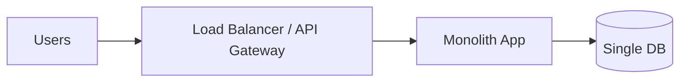

### Redirect flow diagram
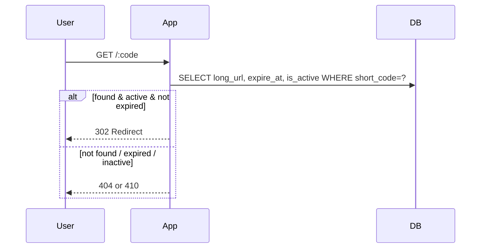

### Capacity (how many users)
**Bottleneck:** DB is hit on *every redirect*.

Typical sustainable range (ballpark):
- **~500–3,000 redirects/sec** before DB latency starts hurting (depends heavily on DB size, indexes, and hardware).

Convert to monthly:
- `Monthly Redirects ≈ QPS * 2.6M seconds/month`
- For 1,000 QPS → ~2.6B redirects/month

MAU approximation:
- If 2.6B redirects/month and 300 redirects/user/month → **~8.6M MAU**
- Realistically, Stage 1 comfort band is closer to **~1–5M MAU** due to DB headroom and peak bursts.

**Stage 1 summary:** Great for MVP / internal usage / early product.

---

# 5) Stage 2 — Split GET and POST services + Read Replicas

### What it adds
- Separate services:
  - **Write service** (POST /shorten)
  - **Read service** (GET /:code)
- DB primary + 1+ read replicas

### Architecture diagram
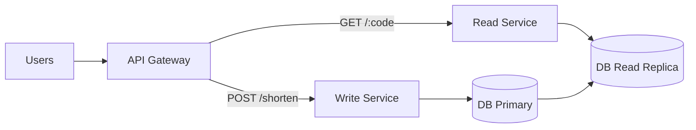

### Flows

#### Write flow
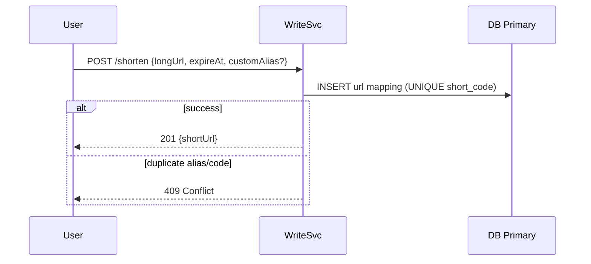

#### Read flow (still DB-bound)
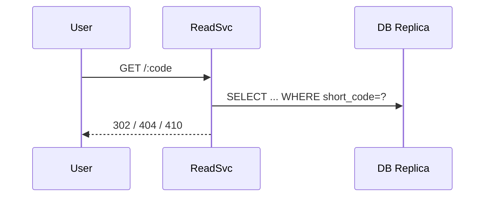

### Capacity
**Bottleneck:** DB replica(s) serve read QPS; primary handles writes.

Typical sustainable range (ballpark):
- Reads: **~2,000–10,000 redirects/sec** depending on number/size of replicas
- Writes: usually far smaller; primary handles writes at this scale

MAU approximation (illustrative):
- 5,000 QPS → ~13B redirects/month
- MAU ≈ 13B / 300 ≈ **~43M MAU** (depends on click behavior)

---

# 6) Stage 3 — Add Redis Cache (Hot Read Path)

### What it adds
- Redis as shared cache for mappings
- Read path: Redis → DB replica on cache miss → backfill Redis

### Architecture diagram
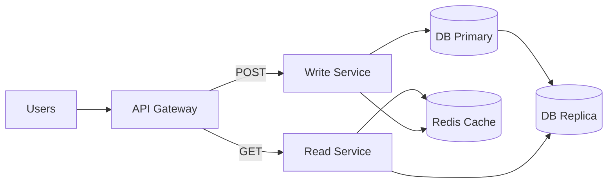

### Redirect flow (cache-first)
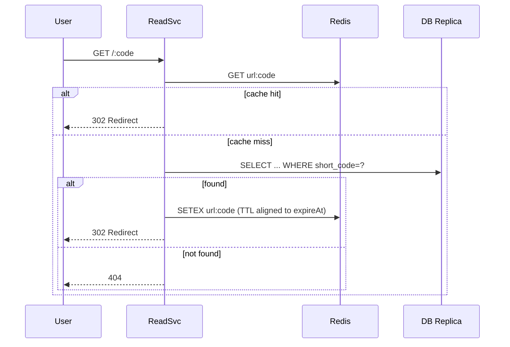

### Capacity
**Bottleneck shifts from DB to cache/network/compute.**

Typical sustainable range (ballpark):
- **~50k–300k redirects/sec** with a modest Redis cluster + scaled read pool
- DB becomes mostly cache-miss traffic (low once warmed)

MAU approximation (illustrative):
- 100k QPS → 260B redirects/month
- MAU ≈ 260B / 300 ≈ **~866M MAU** (theoretical upper range)

---

# 7) Stage 4 — Analytics (Queue + Workers + Warehouse)

### What it adds
- Redirect emits an analytics event asynchronously (must not block redirect)
- Workers process events into:
  - Raw events store
  - Rollup tables (daily/hourly)

### Architecture diagram
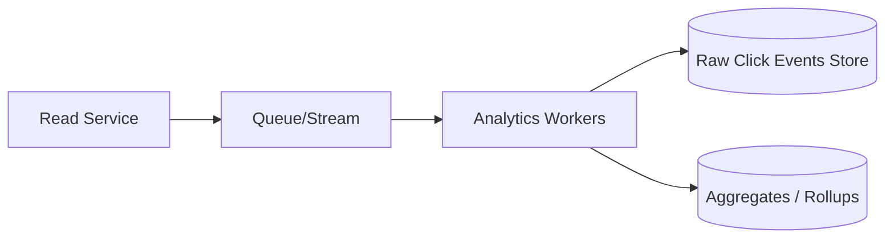

### Analytics flow
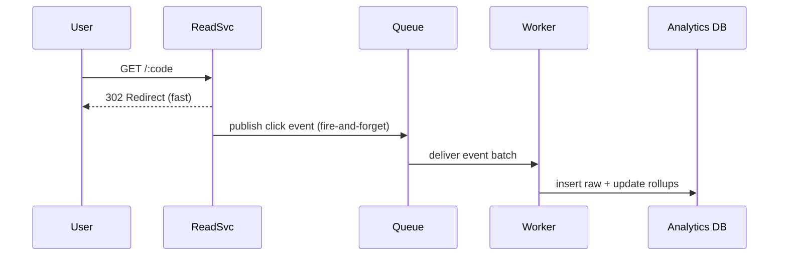

### Capacity impact
Redirect capacity is still Stage 3-like. You size analytics separately:
- Queue throughput (events/sec)
- Worker fleet
- Warehouse/DB write capacity

---

# 8) Stage 5 — Multi-region + CDN/Edge (Endgame)

### What it adds
- Deploy read services + Redis in multiple regions
- CDN absorbs hot redirects at the edge
- GeoDNS routes to nearest region
- Writes either:
  - stay single-region (simpler, strong consistency)
  - or become multi-region with additional mechanisms

### Architecture diagram (endgame)
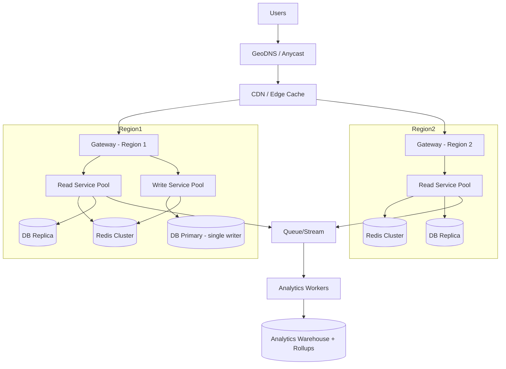

### Capacity
This is “nothing left to scale” in a practical sense:
- **CDN edge caching** removes a huge fraction of origin load
- Multi-region adds both **latency** and **availability** gains

Typical global throughput:
- **Hundreds of thousands to millions of redirects/sec** (with CDN + multi-region)
- Next bottlenecks become:
  - global egress cost
  - operational complexity
  - strong global consistency needs

---

# 9) Failure scenarios (direct answers)

### If DB fails
- Multi-AZ + failover
- Reads served from cache/CDN in degraded mode
- Writes paused or queued

### If CDN/Cloudflare fails
- Keep origin route alive (bypass CDN)
- Optionally multi-CDN failover

### If cloud region fails
- GeoDNS failover to healthy region
- Cross-region replication for reads
- DR plan for writes

### If Redis fails
- System remains correct: fallback to DB
- Latency increases; protect DB from overload

---

# 10) “Redis down + huge traffic”: avoid melting DB

### Practical mitigations
1) **Single-flight per shortCode** (request coalescing)
2) **L1 in-process cache** (tiny TTL for hot keys)
3) **Negative caching** for 404s (stop brute-force scanning)
4) **Rate limiting** for suspicious traffic
5) CDN edge caching for hot links

### Biohack view: Herd protection
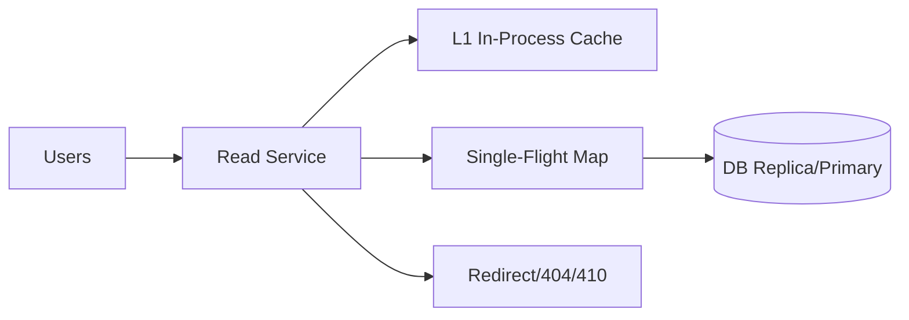

### Single-flight pseudocode
```ts
const inFlight = new Map<string, Promise<any>>();

async function getUrlSingleFlight(code: string) {
  const existing = inFlight.get(code);
  if (existing) return existing;

  const p = (async () => dbReplica.getUrlByShortCode(code))();
  inFlight.set(code, p);

  try {
    return await p;
  } finally {
    inFlight.delete(code);
  }
}
```

---

# 11) Global uniqueness for custom aliases

### Option A: Alias authority service (single-writer)
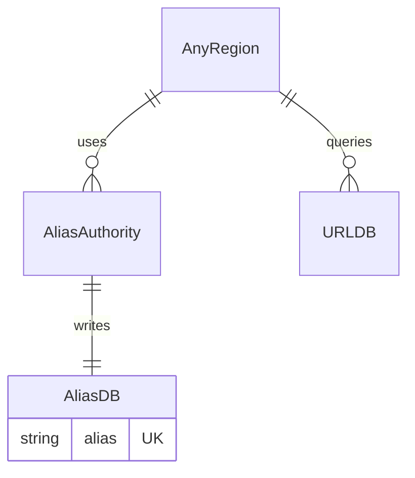

Atomic operation:
- `INSERT alias` (UNIQUE) → if duplicate → 409
- then create URL mapping → commit alias

### Option B: Globally consistent store
- Conditional write: `PUT alias IF NOT EXISTS`
- Stronger, more complex, higher latency/cost

### Option C: Deterministic ownership (hash(alias) → owner shard)
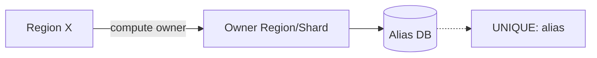

---

# 12) Consistent hashing (biohack diagrams + code)

### Bird’s-eye: consistent hashing lookup
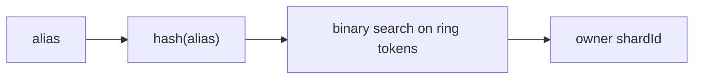

### Ring concept (virtual nodes)
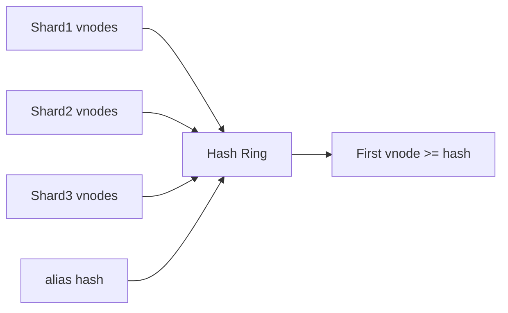

### Owner lookup code
```ts
function getOwnerShard(alias: string, ring: Array<{ token: number; shardId: string }>): string {
  const h = hash(alias);
  let left = 0, right = ring.length - 1, ans = -1;

  while (left <= right) {
    const mid = Math.floor((left + right) / 2);
    if (ring[mid].token >= h) { ans = mid; right = mid - 1; }
    else left = mid + 1;
  }
  return ans === -1 ? ring[0].shardId : ring[ans].shardId;
}
```

---

# 13) Overkills (and why not)

### ZooKeeper / etcd for basic URL mapping
Overkill because:
- stateless services + DB constraints solve correctness
- modern platforms already provide discovery/health checks

### Queuing redirects
Wrong because redirects are synchronous and latency-critical.

### Storing mappings in server memory
Breaks correctness across multiple servers (LB can route to any server).

---

# 14) Final capacity table (stage-by-stage)

| Stage | Key components | Typical sustainable redirects/sec (ballpark) | Approx MAU capacity (ballpark) |
|------:|----------------|--------------------------------------------:|--------------------------------:|
| 1 | Monolith + single DB | ~0.5k–3k rps | ~1–5M MAU |
| 2 | Split GET/POST + replicas | ~2k–10k rps | ~10–50M MAU |
| 3 | Redis cache | ~50k–300k rps | ~100M+ MAU potential |
| 4 | + Analytics pipeline | Redirect similar to Stage 3; analytics scales separately | depends on queue/warehouse |
| 5 | Multi-region + CDN/edge | 300k rps → **millions rps** global | hundreds of millions+ (traffic dependent) |

> These are directional. Real capacity depends on infra choices, payload size, cache hit ratio, and geographic distribution.

---

# 15) Appendix: reference snippets (shorten + redirect)

### Redirect (cache → DB replica → optional primary fallback)
```ts
async function redirectHandler(req, res) {
  const code = req.params.code;
  const key = `url:${code}`;

  // 1) Redis
  try {
    const cached = await redis.get(key);
    if (cached) {
      const rec = JSON.parse(cached);
      return res.redirect(302, rec.longUrl);
    }
  } catch {}

  // 2) Replica
  let row = await dbReplica.getUrlByShortCode(code);

  // 3) Optional: primary fallback to avoid replica lag false-404
  if (!row) row = await dbPrimary.getUrlByShortCode(code);
  if (!row) return res.sendStatus(404);

  // Backfill cache (TTL aligned to expireAt)
  const ttl = row.expireAt ? Math.max(1, Math.floor((row.expireAt.getTime() - Date.now())/1000)) : 86400;
  redis.setex(key, ttl, JSON.stringify({ longUrl: row.longUrl })).catch(()=>{});

  return res.redirect(302, row.longUrl);
}
```
